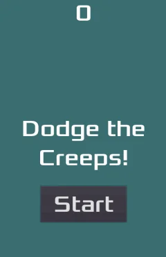

# Dodge the Creeps 2D
This is my first 2D Game, which I created by following the step-by-step tutorial from the [Godot Docs](https://docs.godotengine.org/en/stable/).

In this simple game, you just have to *dodge* enemies for as long as possible.

- **Engine**: Godot .NET
- **Renderer**: Compatibility

## :video_game: Preview

## :computer: How to install
### Requirements
- Windows/Linux/MacOS
- .NET SDK
- Godot Engine .NET

### Steps
1. Download or clone the repository.
2. Import the proyect into Godot by selecting the `project.godot` file.
3. Build and play, or export the project.

**Note:** To export the project, you will need to have the **_export templates .NET_** installed. You can find them in the **All downloads** section of the official [Godot Engine](https://godotengine.org/) website.

## :scroll: How to play
- **ENTER**: Start de game.
- **Arrow Keys**: Move the character.

## :bust_in_silhouette: Credits
The assets are provided by **Godot Engine** as part of their tutorials.
- [Your first 2D game](https://docs.godotengine.org/en/stable/getting_started/first_2d_game/index.html).

All credits to the authors of the original assets are found in the official [godot-demo-projects](https://github.com/godotengine/godot-demo-projects/tree/master/mono/dodge_the_creeps) repository.

## :key: License
This project is open source and available under the [MIT License](./LICENSE).
